<div align="center">


# 📱💰 Intelligent Mobile Price-Range Classification

### *Ensemble Machine Learning + Explainable AI + Production-Ready API & Web Demo*

[](https://python.org)
[](https://fastapi.tiangolo.com)
[](https://djangoproject.com)
[](https://xgboost.ai)
[](https://docker.com)
[](https://opensource.org/licenses/MIT)

**Tune • Ensemble • Explain • Serve**

[Features](#-features) • [Installation](#️-installation) • [Quick Start](#-quick-start) • [Results](#-results) • [Project Structure](#-project-structure) • [Contributing](#-contributing)

</div>

---

## 📖 Overview

**PricePulse** is a full machine learning pipeline and production service that predicts a mobile phone's **price range** (Low / Medium / High / Very High) from its technical specifications — RAM, battery, camera, display, and connectivity features.

It goes beyond a single notebook model: ten classification algorithms are tuned with **Bayesian optimization (Optuna)**, combined through **Stacking and Weighted Voting ensembles**, explained per-prediction with **SHAP**, and served through both a **FastAPI** backend and a **Django** web demo — with a full automated test suite and Docker deployment.

<div align="center">

### 🎯 **Why This Project?**

| **Rigorous Tuning** | **Explainable** | **Battle-Tested** | **Deployable** |
|:---:|:---:|:---:|:---:|
| Asymmetric Optuna budget per model complexity | SHAP explains every single prediction | 26+ automated tests, Nested CV validation | FastAPI + Django + Docker, ready to ship |

</div>

---

## ✨ Features

### ▶️ Model Pipeline — 10 Algorithms + 2 Ensembles

```mermaid
graph LR
    A[Raw Phone Specs] --> B[Preprocessing]
    B --> C{Optuna Tuning}
    C --> D[LogReg / SVM / KNN / NB]
    C --> E[RF / GBM]
    C --> F[XGBoost / LightGBM / CatBoost]
    C --> G[MLP]
    D & E & F & G --> H{Ensemble}
    H -->|Weighted| I[Voting]
    H -->|Meta-Learner| J[Stacking]
    I & J --> K[Best Model]

    style A fill:#1c2130
    style K fill:#1a3320
```



Each of the 10 base models is tuned with its **own trial budget** — simple models (KNN, Naive Bayes) get fewer trials, complex gradient-boosting models get more — instead of one-size-fits-all tuning.

---

### 🧠 Explainability — SHAP on Every Prediction

Instead of a black-box score, every prediction ships with the **top 5 contributing features** and their direction of effect:

```
GET /predict/explain
→ ram: +0.63   (pushed toward "Very High")
→ battery_power: +0.06
→ mobile_wt: -0.01
```

A global SHAP summary chart is also generated during training to show overall feature importance across the whole model.

---

### 🌐 Two Ways to Use It

<table>
<tr>
<td width="50%">

#### ⚡ FastAPI Service
- `/predict` — single prediction
- `/predict/batch` — up to 500 at once
- `/predict/explain` — SHAP explanation
- `/model/info` — metrics & metadata
- Auto-generated docs at `/docs`

</td>
<td width="50%">

#### 🖥️ Django Web Demo
- Clean RTL-friendly form UI
- Live confidence bars per class
- "Why did the model decide this?" panel
- Talks to the FastAPI service over HTTP

</td>
</tr>
</table>

### 📊 Rigorous Evaluation, Not Just Accuracy

| Method | What It Checks |
|--------|-----------------|
| **5-Fold Cross-Validation** | Stability across data splits |
| **Nested CV** | Unbiased estimate — tuning fully separated from evaluation |
| **Paired t-test / Wilcoxon** | Is the ensemble *actually* better than the best single model? |
| **Brier Score Calibration** | Are predicted probabilities trustworthy? |
| **Quadratic Weighted Kappa** | How "close" are the mistakes, not just right/wrong? |

### 📋 Sample Training Log

<details>
<summary><b>Sample Pipeline Run</b></summary>

```
14:23:01 | INFO | === شروع پایپ‌لاین PricePulse ===
14:23:02 | INFO | داده بارگذاری شد. ویژگی‌ها: 20
14:23:02 | INFO | === مرحله تیونینگ هوشمند با Optuna ===
14:23:45 | INFO | svm: بهترین CV accuracy = 95.50%
14:24:10 | INFO | xgboost: بهترین CV accuracy = 89.43%
14:24:55 | INFO | === ساخت Stacking Ensemble ===
14:25:20 | INFO | Stacking (meta=LogReg): CV=95.50% | Stacking (meta=XGBoost): CV=91.07%
14:25:20 | INFO | meta-learner انتخاب‌شده: Logistic Regression
14:25:22 | INFO | بهترین مدل نهایی: stacking با دقت 97.83%
14:25:22 | INFO | === پایپ‌لاین با موفقیت به پایان رسید ===
```

</details>

### 🛡 Production-Ready Details

- **Input Validation** — every field range-checked (Pydantic), rejects nonsense specs
- **Structured Logging** — every request logged with timing
- **CORS Enabled** — ready for a separate frontend
- **26 Automated Tests** — data loading, ensembling, registry, and full API behavior

---

## 🛠️ Installation

### Prerequisites

```
Python  >= 3.10
pip
```

### Setup

```bash
# 1. Extract this archive, then enter the ML project
cd pricepulse

# 2. Install dependencies
pip install -r requirements.txt

# 3. Train the model (uses config.py defaults)
python pipeline.py
```

`pipeline.py` will:
- Load and preprocess the dataset
- Tune all 10 models with Optuna (asymmetric budget)
- Build Weighted Voting and Stacking ensembles
- Save the best model to `artifacts/`
- Generate comparison and SHAP charts

### Optional — Web Demo Setup

```bash
cd ../pricepulse_webdemo
pip install -r requirements.txt
python manage.py migrate
```

<details>
<summary><b>Platform Notes</b></summary>

**All platforms:**
- XGBoost / LightGBM / CatBoost install via pip with no extra system dependencies
- SHAP's `KernelExplainer` is used — expect ~2s on the first explanation call (cached after)

**Docker (API only):**
```bash
cd pricepulse
docker compose up --build
```
Train the model locally first (`python pipeline.py`) so `artifacts/` is populated before building the image.

</details>

---

## 🚀 Quick Start

### Run the API

```bash
cd pricepulse
uvicorn serving.api:app --reload
```
Open `http://localhost:8000/docs` for interactive API docs.

### Run the Web Demo

1. **Start the API first** (see above) — the web demo calls it over HTTP
2. **In a second terminal:**
   ```bash
   cd pricepulse_webdemo
   python manage.py runserver
   ```
3. **Open** `http://localhost:8000` *(Django's own port, e.g. 8000 or 8001 if the API already uses 8000)*
4. **Fill in the phone specs** and click **پیش‌بینی قیمت** — see the predicted range, confidence bars, and SHAP explanation

### Run the Tests

```bash
cd pricepulse && pytest tests/ -v
cd ../pricepulse_webdemo && python manage.py test predictor -v 2
```

---

## 📈 Results

| Model | Test Accuracy | CV Accuracy |
|---|---|---|
| **Stacking (final model)** | **97.83%** | 95.50% ± 1.25% |
| SVM | 97.50% | 95.50% ± 1.44% |
| Logistic Regression | 97.33% | 95.50% ± 1.71% |
| Weighted Voting | 95.83% | 93.00% ± 0.97% |
| XGBoost | 93.83% | 89.43% ± 1.29% |
| Random Forest | 87.17% | 85.57% ± 0.92% |

**Key finding:** PCA dimensionality reduction *hurts* this problem (96% → 55% for SVM) because RAM alone carries most of the predictive signal — a full write-up with two additional real-world datasets, four alternative algorithms tested (ordinal classification, regression-then-bin, hierarchical, hybrid), and every negative result is documented in `PricePulse_Paper.docx`.

---

## 📂 Project Structure

```
.
├── pricepulse/                   # ML pipeline + API
│   ├── config.py                  # All settings (config-driven)
│   ├── data/loader.py              # CSV loading & validation
│   ├── features/engineering.py     # Domain features + optional PCA
│   ├── models/
│   │   ├── base_models.py           # 10-model registry + Optuna search spaces
│   │   ├── tuner.py                 # Asymmetric-budget Bayesian tuning
│   │   └── calibration.py           # Probability calibration (Brier Score)
│   ├── ensemble/combiner.py        # Weighted Voting + Stacking
│   ├── evaluation/nested_cv.py     # Unbiased performance estimation
│   ├── explainability/shap_explainer.py
│   ├── registry/model_registry.py  # Model save/load + versioning
│   ├── serving/api.py              # FastAPI service
│   ├── tests/                      # 26 unit/integration tests
│   ├── pipeline.py                 # End-to-end training entry point
│   ├── Dockerfile / docker-compose.yml
│   └── artifacts/                  # Trained model + metadata (generated)
│
└── pricepulse_webdemo/            # Django UI for the API
    ├── core/                       # Django settings & URLs
    └── predictor/
        ├── forms.py                 # Phone-specs form
        ├── views.py                 # Calls the FastAPI service
        ├── templates/                # RTL result page
        └── tests.py                  # 5 Django tests
```

### Architecture Overview

**`models/tuner.py`** — `OptunaTuner.tune_all()` accepts a `per_model_trials` dict so complex models (XGBoost, CatBoost) get more search budget than simple ones (KNN, Naive Bayes).

**`ensemble/combiner.py`** — Builds Stacking with a **configurable meta-learner** and automatically compares Logistic Regression vs. XGBoost as the final estimator, picking whichever generalizes better on CV.

**`serving/api.py`** — Loads the model once at first request (`_load_bundle`), caches the SHAP explainer after first use, and logs every request with timing via middleware.

**`predictor/views.py`** — Pure presentation layer: builds the form, POSTs to the FastAPI `/predict` and `/predict/explain` endpoints, never touches the model directly.

---

## 🐛 Troubleshooting

<details>
<summary><b>API returns 503 "مدل هنوز آموزش داده نشده"</b></summary>

Run `python pipeline.py` inside `pricepulse/` first — this trains the model and populates `artifacts/`. The API needs that file to exist before it can serve predictions.

</details>

<details>
<summary><b>Django shows "اتصال به سرویس API برقرار نشد"</b></summary>

The FastAPI service isn't running or is on a different port. Start it with `uvicorn serving.api:app --reload` and, if it's not on `localhost:8000`, set:
```bash
export PRICEPULSE_API_URL=http://localhost:8000
```

</details>

<details>
<summary><b>SHAP explanation is slow on the first request</b></summary>

This is expected — the `KernelExplainer` is initialized once per server run (~2s) and cached for all subsequent calls (~0.3s each).

</details>

<details>
<summary><b>XGBoost / LightGBM / CatBoost fail to install</b></summary>

These occasionally need a C++ build toolchain on some systems. On Windows, install the "Desktop development with C++" workload from Visual Studio Build Tools; on Linux, `sudo apt install build-essential`.

</details>

<details>
<summary><b>Pipeline takes too long to run</b></summary>

The default `config.py` budget (`per_model_trials`, up to 50 trials for XGBoost/LightGBM) can take 15–30 minutes with 10 models. Lower the trial counts in `TuningConfig` for a quick smoke test.

</details>

---

## 🤝 Contributing

Contributions are welcome! Here's how to get started:

```bash
# 1. Fork the repository on GitHub

# 2. Clone your fork
git clone https://github.com/YOUR_USERNAME/pricepulse.git

# 3. Create a feature branch
git checkout -b feature/your-feature-name

# 4. Make your changes and commit
git commit -m "Add: description of your change"

# 5. Push and open a Pull Request
git push origin feature/your-feature-name
```

### Areas to Contribute

| Area | Ideas |
|------|-------|
| 🧠 **Modeling** | Bring in real market data (see `MOBILES2025_DATASET_NOTES.md`) |
| 🔍 **Explainability** | Faster SHAP via `TreeExplainer` for tree-based base models |
| 🌐 **Web Demo** | Migrate Django UI to a proper SPA / mobile app |
| 🔐 **Security** | API key auth for the FastAPI service |
| 🧪 **Tests** | Property-based tests for the ensemble combiner |
| 📖 **Docs** | English translation of the IMRaD paper |

---

## 📄 License

This project is licensed under the **MIT License**. See the [LICENSE](LICENSE) file for details.

---

## 🙏 Acknowledgments

<div align="center">

### Built With NAVIKI Labs

[](https://python.org)
[](https://scikit-learn.org)
[](https://optuna.org)

### Special Thanks To

**Optuna Team** | **SHAP (Lundberg & Lee)** | **Open Source Contributors**
:---: | :---: | :---:
Bayesian hyperparameter optimization | Unified model explainability | scikit-learn, XGBoost, LightGBM, CatBoost, FastAPI, Django and more

</div>

---

<div align="center">


### ✨ **Built with ❤️ for smarter pricing decisions** ✨

[](https://github.com/7Na7iD7)
[](https://github.com/nikifarzami)

</div>
